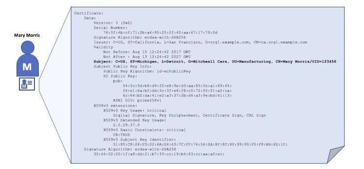

# 身份

## 什么是身份？

区块链网络中的不同参与者包括节点，订购者，客户端应用程序，管理员等。这些参与者中的每一个——网络内部或外部能够使用服务的活动元素——都具有封装在X.509数字证书中的数字身份。这些身份确实很重要，因为它们 **确定了对资源的确切权限以及对参与者在区块链网络中拥有的信息的访问权限。** 

此外，数字身份还具有 Fabric 用于确定权限的一些其他属性，并且它为身份和关联属性的并集提供了特殊名称—— **主体** 。Principal 就像 userIDs 或 groupIDs，但更灵活一点，因为它们可以包含 actor 的身份的各种属性，例如 actor 的组织，组织单位，角色甚至是 actor 的特定身份。当我们谈论主体时，它们是决定其权限的属性。

要使身份可以**验证**，它必须来自**可信任的**权威机构。 [成员服务提供者](../membership/membership.html) （MSP）是 Fabirc 中可以信任的权力机构。更具体地说，一个 MSP 是定义管理该组织的有效身份的规则的组件。Fabric 中的默认 MSP 实现使用 X.509 证书作为身份，采用传统的公钥基础结构（PKI）分层模型（稍后将详细介绍PKI）。

## 一个简单的场景来解释身份的使用

想象你去超市购买一些杂货。在结账时，你会看到一个标志，表明只接受 Visa，Mastercard 和 AMEX 卡。如果你尝试使用其他卡付款——我们称之为“想象卡”——无论该卡是否真实、或你的帐户中是否有足够的资金，都无关紧要。它不会被接受。

*拥有有效的信用卡是不够的——它也必须被商店接受！PKI 和 MSP 以相同的方式协同工作——PKI提供身份列表，MSP说哪些是参与网络的给定组织的成员。* 

PKI 证书和 MSP 提供了类似的功能组合。PKI 就像一个卡提供商——它分配了许多不同类型的可验证身份。另一方面，MSP类似于商店接受的卡提供商列表，确定哪些身份是商店支付网络的可信成员（参与者）。 **MSP将可验证的身份转变为区块链网络的成员** 。 

让我们更详细地深入研究这些概念。

## 什么是PKI？

**公钥基础结构（PKI）是一组互联网技术，可在网络中提供安全通信。** 是PKI将 **S** 放在 **HTTPS** 中——如果你在网页浏览器上阅读这个文档，你可能正使用 PKI 来确保它来自一个验证过的源。

*公钥基础结构（PKI）的元素。PKI 由向各方（例如，服务的用户，服务提供者）发布数字证书的证书授权中心组成，然后使用它们在与其环境交换的消息中对自己进行身份验证。CA 的证书撤销列表（CRL）构成不再有效的证书的参考。证书的撤销可能由于多种原因而发生。例如，证书可能被撤销，因为与证书相关联的加密私有材料已被公开。* 

虽然区块链网络不仅仅是一个通信网络，但它依赖于PKI标准来确保各个网络参与者之间的安全通信，并确保在区块链上发布的消息得到适当的认证。因此，了解 PKI 的基础知识以及为什么MSP如此重要是非常重要的。

PKI有四个关键要素：

 * **数字证书**
 * **公钥和私钥**
 * **证书授权中心**
 * **证书撤销列表**

让我们快速描述这些PKI基础知识，如果你想了解更多细节， [维基百科](https://en.wikipedia.org/wiki/Public_key_infrastructure)是一个很好的起点。

## 数字证书

数字证书是包含与证书持有者有关的一组属性的文档。最常见的证书类型是符合 [X.509标准](https://en.wikipedia.org/wiki/X.509)的证书，它允许在其结构中编码一方的识别细节。

例如，密歇根州底特律的Mitchell汽车的制造部门的Mary Morris可能有一个带有 `SUBJECT` 属性为 `C=US`,
`ST=Michigan`, `L=Detroit`, `O=Mitchell Cars`, `OU=Manufacturing`, `CN=Mary Morris /UID=123456` 的数字证书。Mary的证书类似于她的政府身份证——它提供了玛丽的信息，她可以用来证明关于她的重要事实。X.509证书中还有许多其他属性，但现在让我们专注于这些。

*描述一个名为 Mary Morris 的组织的数字证书。Mary是证书的 `SUBJECT` ，突出显示的 `SUBJECT` 文本显示了关于 Mary 的重要事实。如你所见，证书还包含更多信息。最重要的是，Mary 的公钥是在她的证书中分发的，而她的私人签名密钥则不是。此签名密钥必须保密。*

重要的是，Mary 的所有属性都可以使用称为密码学（字面意思，“ *秘密书写* ”）的数学技术进行记录，这样篡改将使证书无效。只要对方信任证书颁发者，即 **证书授权中心** （CA），密码学就允许 Mary 将证书提交给其他人以证明其身份。只要 CA 安全地保存某些加密信息（意味着它自己的 **私人签名密钥** ），任何阅读证书的人都可以确定有关 Mary 的信息没有被篡改——它将始终具有 Mary Morris 的特定属性。将 Mary 的 X.509 证书视为无法改变的数字身份证。

## 授权，公钥和私钥

身份验证和消息完整性是安全通信中的重要概念。身份验证要求确保交换消息的各方创建特定消息的身份。对于具有“完整性”的消息意味着在其传输期间不能被修改。例如，你可能希望确保与真正的 Mary Morris 而不是模仿者进行沟通。或者，如果 Mary 向你发送了一条消息，你可能希望确保其在传输过程中没有被其他任何人篡改过。

传统的身份验证机制依赖于 **数字签名** ，顾名思义，它允许一方对其消息进行数字 **签名** 。数字签名还可以保证签名消息的完整性。

从技术上讲，数字签名机制要求每一方保存两个加密连接的密钥：广泛可用的公钥和充当授权锚的私钥，以及用于在消息上产生**数字签名**的私钥 。数字签名消息的接收者可以通过检查附加签名在预期发送者的公钥下是否有效来验证接收消息的来源和完整性。

**私钥和相应公钥之间的唯一关系是使安全通信成为可能的加密魔法** 。密钥之间的唯一数学关系使得私钥可以用于在仅对应的公钥可以匹配的消息上产生签名，并且仅在相同的消息上。

在上面的示例中，Mary 使用她的私钥对邮件进行签名。任何使用她的公钥查看签名消息的人都可以验证签名。

## 证书授权中心

如你所见，人员或节点能够通过由系统信任的机构为其发布的 **数字身份** 参与区块链网络。在最常见的情况下，数字身份（或简称 **身份** ）具有符合X.509标准并由证书授权中心（CA）颁发的经加密验证的数字证书的形式。

CA是互联网安全协议的常见部分，你可能已经听说过一些比较流行的协议：Symantec（最初是Verisign），GeoTrust，DigiCert，GoDaddy 和 Comodo 等。

*证书授权中心向不同的参与者颁发证书。这些证书由CA进行数字签名，并将人员与人员的公钥绑定在一起（并且可选地具有全面的属性列表）。因此，如果一个人信任CA（并且知道其公钥），则可以信任特定参与者绑定到证书中包含的公钥，并通过验证参与者证书上的 CA 签名来拥有所包含的属性。* 

证书可以广泛传播，因为它们既不包括人员也不包括 CA 的私钥。因此，它们可以用作信任的锚，用于验证来自不同参与者的消息。

CA 也有一个证书，它们可以广泛使用。这允许由给定 CA 发布的身份的消费者通过检查证书只能由相应私钥（CA）的持有者生成来验证它们。

在区块链设置中，希望与网络交互的每个参与者都需要一个身份。在此设置中，你可能会说 **一个或多个 CA** 可用于 **从数字角度定义组织的成员** 。CA 是为组织的参与者提供可验证的数字身份的基础。

### 根CA，中介CA和信任链

CA的有两种形式： **根CA** 和 **中介CA** 。因为根CA（Symantec，Geotrust等）必须 **安全地** 向互联网用户 **颁发** 数亿个证书，所以将这个过程分散到所谓的 *中介CA中* 是有意义的。这些中介CA具有由根CA或其他中间机构颁发的证书，允许为链中的任何CA颁发的任何证书建立“信任链”。追溯到根CA的这种能力不仅允许CA的功能在仍然提供安全性的同时进行扩展——允许使用证书的组织充满信心地使用中介CA——它限制了根CA的暴露，其如果受到损害，将会危及整个信任链。另一方面，如果中介CA受到损害，则曝光量会小得多。

*只要每个中介 CA 的证书的颁发 CA 是根 CA 本身或具有对根 CA 的信任链，就在根CA和一组中介 CA 之间建立信任链。* 

中介 CA 在跨多个组织颁发证书时提供了巨大的灵活性，这在许可的区块链系统（如Fabric）中非常有用。例如，你将看到不同的组织可能使用不同的根 CA，或者使用具有不同中介 CA 的相同根 CA ——它确实取决于网络的需求。

### Fabric CA

因为 CA 非常重要，Fabric 提供了一个内置的 CA 组件，允许你在你构成的区块链网络中创建 CA。此组件——称为 **Fabric CA** ，是一个私有根 CA 提供程序，能够管理具有 X.509 证书形式的 Fabric 参与者的数字身份。由于 Fabric CA 是针对 Fabric 的根 CA 需求的自定义 CA，因此它本身无法为浏览器中的常规/自动使用提供 SSL 证书。但是，由于 **某些** CA 必须用于管理身份（即使在测试环境中），因此可以使用 Fabric CA 来提供和管理证书。使用公共/商业根或中介 CA 来提供识别也是可能的——并且完全合适。

如果你有兴趣，你可以[在CA文档部分](http://hyperledger-fabric-ca.readthedocs.io/)阅读有关 Fabric CA 的更多信息。

## 证书撤销列表

证书撤销列表（CRL）很容易理解——它只是CA知道由于某种原因而被撤销的证书的引用列表。如果你回想商店场景，CRL 就像被盗信用卡列表一样。

当第三方想要验证另一方的身份时，它首先检查颁发CA的CRL以确保证书尚未被撤销。验证者不是必须要检查 CRL，但如果不检查，则他们冒着接受受损身份的风险。

*使用 CRL 检查证书是否仍然有效。如果模仿者试图将受损的数字证书传递给验证者，则可以首先检查颁发 CA 的 CRL，以确保其未列为不再有效。* 

请注意，被撤销的证书与证书过期非常不同。撤销的证书尚未过期——按其他措施，它们是完全有效的证书。有关 CRL 的更多深入信息，请单击 [此处](https://hyperledger-fabric-ca.readthedocs.io/en/latest/users-guide.html#generating-a-crl-certificate-revocation-list)。

现在你已经了解了 PKI 如何通过信任链提供可验证的身份，下一步是了解如何使用这些身份来代表区块链网络的可信成员。这就是成员服务提供者（MSP）发挥作用的地方—— **它确定了区块链网络中特定组织成员的各方** 。

要了解有关成员的更多信息，请查看有关 [MSP](../membership/membership.html)的概念文档。

<!---
Licensed under Creative Commons Attribution 4.0 International License https://creativecommons.org/licenses/by/4.0/
-->
