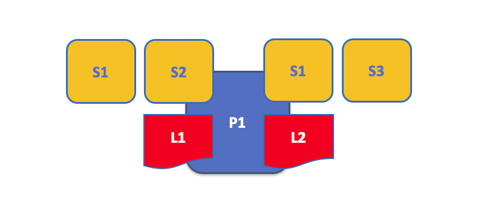
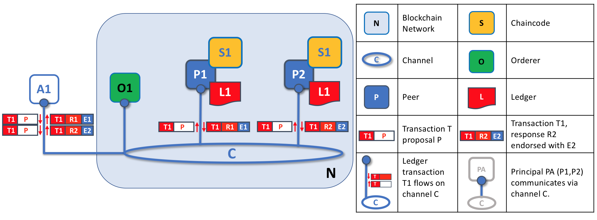
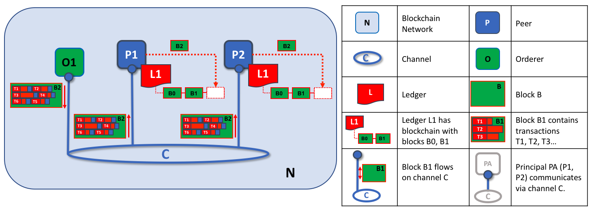

# Peer 节点

一个区块链网络主要由一些 *peer 节点*（或者简单称之为 *peers*）组成。Peers 是网络的基本元素，因为他们存储了账本和智能合约。之前我们说过一个账本能够将由智能合约（在 Hyperledger Fabric 中是包含在一个 *链码*中的，稍后会详细介绍）生成的所有交易无法篡改地记录下来。智能合约和账本用来将在网络中共享的 *流程* 和共享的 *信息* 对应地封装起来。一个 peer 的这些方面是理解一个 Fabric 网络的很好的起点。

一个区块链网络中的其他部分当然也非常重要：账本和智能合约，排序节点，策略，channels，应用程序，组织，身份和成员关系，你可以在其他的文档中了解更多。这个部分会集中在 peers 上，以及他们同一个 Hyplerledger Fabric 网络中的其他要素的关系。

*一个区块链网络是由 peer 节点组成的，每个节点都由账本的副本以及智能合约的副本。在这个例子中，网络 N 是由 peers P1、P2 和 P3 组成的，每个节点维护他们自己的分布式账本 L1 的实例。P1、P2 和 P3 使用相同的链码 S1 来访问他们的分布式账本的副本。*

Peers 可以被创建、启动、停止、重新配置甚至删除。他们暴露了一系列的 APIs，这允许了管理者和应用程序能够同他们所提供的服务互动。我们会在这里学习更多关于这些服务的知识。

### 专业术语上的一个词

Fabric 是使用一个被称为 **链码** 的技术概念来实现 **智能合约** 的 --- 一段简单使用支持的编程语言编写的代码来访问账本。在这个话题中，我们会经常使用名词 **链码**，但是如果你更习惯于使用 **智能合约** 的话，你也可以将它读成 **智能合约**。他们是同一件事情！如果你想了解更多关于链码和智能合约的话，查看我们的 [智能合约和链码文档](../smartcontract/smartcontract.html)

## 账本和 Chaincode

让我们更详细地了解一下 peer。我们能够看到其实是 peer 在运行着账本以及 chaincode。更加确切地说，peer 其实运行的是账本及 chaincode 的 *实例*。请注意这其实是在一个 Fabric 网络中提供了一个故意地冗余 --- 这可以避免单点失败。我们会在接下来的章节中了解更多有关一个区块链网络的分布式和去中心化的特点。

*一个 peer 运行着账本及 chaincode 的实例。在这个例子中，P1 运行着账本 L1 和 chaincode S1 的实例。这里可以由很多的账本及 chaincodes 运行在一个独立的 peer 上*

因为一个 peer 是一个账本及 chaincodes 的 *宿主*，应用程序及管理员如果想要访问这些资源，他们必须要同一个 peer 进行交互。这就是为什么 peers 被认为是一个 Hyperledger Fabric 网络的最基本的组成模块。当有一个 peer 被第一次创建的时候，它并没有账本也没有 chaincodes。我们将会在接下来看到在 peer 上账本是如何被创建的，以及 chaincode 是如何被安装的。

### 多个账本

一个 peer 可以运行多个账本，这是很有用的，因为它能够进行一个很灵活的系统设计。最简单的配置就是一个 peer 管理一个单独的账本，但是当需要的时候，一个 peer 运行两个或者更多的账本也是非常适合的。

*一个 peer 运行多个账本。Peers 运行着一个或者多个账本，并且每个账本具有零个或者多个 chaincode 可以应用到账本中。在这个例子中，我们能够看到 peer P1 运行了账本 L1 和 L2。账本 L1 使用 chaincode S1 来访问。账本 2 可以使用 chaincodes S1 和 S2 访问。*

尽管一个 peer 只运行一个账本的实例而不运行任何的用来访问账本的 chaincodes 是完全可能的，但是很少有 peers 会像这样来进行配置。大多数的 peers 将会至少安装一个 chaincode，用它来查询或更新 peer 的账本实例。有必要说明一下，无论用户是否安装了被外部应用使用的 chaincodes，peers 总是会有一个特殊的 **系统 chaincodes**。这个不会在这个章节中进行讨论。

### 多个 chaincodes

账本数量和访问账本的 chaincode 的数量之间没有固定的关系。一个 peer 可能会有很多 chaincodes，也可能会有很多账本来被它访问。

*这是一个运行着多个 chaincodes 的一个 peer。每个账本可以拥有多个访问它的 chaincodes。在这个例子中，我们能够看到 peer P1 运行着账本 L1 和 L2，L1 可以通过 chaincode S1 和 S2 来访问，账本 L2 可以由 S1 和 S3 来访问。我们能够看到 chaincode S1 既能访问 L1 也能访问 L2。*

稍后我们会看到在 Hyperledger Fabric 中，当一个 peer 运行多个账本或多个 chaincodes 的时候，为什么 **channels** 这个概念就会变得非常重要。

## 应用程序和 peers

现在我们要展示应用程序是如何通过跟 peers 的交互来访问账本的。查询账本的操作涉及到了在一个应用程序和一个 peer 之间的一个简单的三步对话；更新账本的操作会涉及到更多的步骤，需要额外的两步。我们将这些步骤进行一点简化来帮助你开始了解 Hyperledger Fabric，但是不要担心 --- 你需要理解的最重要的部分是应用程序和 peer 之间进行查询账本和更新账本的交易类型之间的不同之处。

当应用程序需需要访问账本和 chaincodes 的时候，他们总是需要连接到 peers。Hyperledger Fabric SDK 将这个操作变得非常简单 --- 它的 APIs 使应用程序能够连接到 peers，调用 chaincodes 来生成交易，提交交易到网络，在网络中交易会被排序并且提交到分布式账本中，并且在这个流程结束的时候接收到事件。

通过连接一个 peer，应用程序能够执行 chaincodes 来查询或者更新一个账本。对账本的查询结果马上会返回，但是对于账本的更新会在应用程序，peers 以及排序者之间有更复杂的交互。让我们更详细地研究一下。

*Peers，连同排序者，确保了账本在每个 peer 上都具有一个最新的账本。在这个例子中，应用程序 A 连接到了 P1 并且调用了 chaincode S1 来查询或者更新账本 L1。P1 调用了 chaincode S1 来生成一个提案的回应，这个回应包含了一个查询结果或者一个账本更新的提案。应用程序 A 接收到了提案的反馈，对于查询来说，流程到这里就结束了。对于更新来说，应用程序 A 会从所有的反馈中创建一笔交易，它会把这笔交易发送给排序者 O1 来进行排序。O1 会搜集网络中的交易并打包到区块中，然后将区这些区块分发到所有 peers 上，包括 P1。P1 会在把交易提交到账本 L1 之前对交易进行验证。当 L1 被更新之后，P1 会生成一个事件，该事件会被 A 接收到，来标识这个过程结束了。*

一个 peer 可以马上将查询的结果返回给一个应用程序，因为满足这个查询的所有信息都是存在 peer 本地的一个账本副本中的。Peers 从来不会为了给来自于一个应用程序的查询返回结果而去询问其他的 peers 的。但是应用程序还是能够连接到一个或者多个 peers 来执行一个查询；比如，为了协调在多个 peers 间的一个结果，或者当怀疑数据不是最新的时候，需要从一个不同的 peer 获得一个更新的结果。在这个图标中，你能够看到账本查询是一个简单的三步流程。

一笔更新的交易同一笔查询的交易具有相同的起点，但是具有两个额外的步骤。尽管更新账本的应用程序也会连接到 peers 来调用 chaincode，但是不想查询账本的应用程序，一个独立的 peer 目前是不能进行一个账本的更新的，因为其他的 peers 必须首先要同意这个变动 --- 一个被称为 **共识** 的流程。因此，peers 会返回给应用程序一个 **被提案过的** 更新 --- 这个 peer 会依据其他的 peers 之前的协议来应用这个更新。第一个额外的步骤 --- 第四步 --- 要求应用程序发送一个合适的一系列的匹配的被提案的更新到整个由 peers 组成的网络中，作为一笔提交到他们账本中的交易。应用程序通过使用一个 **排序者** 来讲交易打包到区块中，然后将他们分发到整个由 peers 组成的网络中，在这个网络中，当被更新到每个 peer 本地账本的副本中之前，这些区块都可以被验证。因为这个整个的排序流程会需要一些时间来完成 (数秒钟)，应用程序会被异步地通知，就像步骤五中所展示的。

在这个部分的后边，你将会了解到更多关于这个排序流程的更详细的信息 --- 如果你想更加详细地了解一下这个流程，你可以阅读 [Transaction Flow](../txflow.html) 这个话题。

## Peers 和 Channels

尽管该部分更关注于 peers 而不是 channels，但是花一些时间来理解 peers 是如何通过应用程序，使用 *channels* 彼此进行交互还是很值得的 --- 这是在一个区块链网络中一系列的组件能够进行交流和 *私密地* 地交换的一个机制。

这些组件通常是 peer 节点、排序节点和应用程序，并且通过加入一个 channel，他们同意在那个 channel 中通过互相合作来共享以及管理完全一致的账本副本。概念上来说，你可以把 channels 想象为类似于一个由朋友组成的群组一样 (尽管一个 channel 中的成员不需要是朋友！)。一个人可能会有很多个朋友的群组，在每个群组中他们会共同地进行一些活动。这些群组可能是完全独立的 (一个工作伙伴的群组和一个兴趣爱好伙伴的群组)，或者群组键可能会有交叉的部分。然而，每个群组都是它自己的实体，具备某种 "规则"。

*Channels 允许在一个区块链网络中一个指定的一些 peers 以及应用程序来彼此进行交互。在这个例子中，应用程序 A 能够直接同 peers P1 和 P2 使用 channel C 来下进行沟通。你可以把 channel 想象为在某些应用程序和 peers 之间进行通信的一条小路。(简单来说，排序节点在这个图表中没有被显示，但是它必须要存在于一个工作的网络中。)*

我们能够看到 channels 跟 peers 是以不同的方式存在的 --- 将 channel 理解为由物理的 peers 的一个集合组成的逻辑结构更合适一些。*理解这一点至关重要 --- peers 提供了对于访问和管理 channels 的控制*。

## Peers 和组织

现在你已经理解了 peers 以及他们同账本、chaincodes 和 channels 间的关系，你将会看到多个组织是如何走到一起来构成一个区块链网络的。

区块链网络是由一些组织的一个结合来管理的，而不是由单独的一个组织来管理的。对于如何构建这种类型的分布式网络，peers 是核心，因为他们是由这些组织所有，也是这些组织同这个网络的连接点。

*在一个网络中的 peers 带有多个组织。区块链网络是由不同的组织所拥有并贡献的 peers 构成的。在这个例子中，我们看到由四个组织贡献了八个 peers 来组成一个网络。在网络 N 中，Channel C 连接了这些 peers 中的五个 --- P1，P3，P5，P7 和 P8。这些组织所拥有的其他的 peers 并没有加入这个 channel，但是通常会至少加入一个另外的 channel。由某个特定组织所开发的应用程序将会连接到他们自己组织的 peers，其他不同的组织也是一样。简单来说，一个排序节点在这个图标中并没有表示出来。*

你能够看到当在形成一个区块链网络的时候都发生了什么真的是非常重要的。*这个网络是由多个组织来组成并维护的，这些组织向这个网络中贡献资源。* Peers 是我们在这个话题中正在讨论的资源，但是一个组织提供的资源不仅仅是 peers。这里有一个工作的原则 --- 如果组织不为这个网络贡献他们的资源，这个网络是不会存在的。更关键的是，这个网络会随着这些互相合作的组织提供的资源而增长或者萎缩。

你能够看到 (并非排序服务)，这里没有一个中心化的资源 --- 在 [上边的例子](#Peer8) 中，如果这些组织不贡献他们的 peers 的话，这个网络，**N** 是不会存在的。这反应了这个网络是不会有任何意义存在的，除非并且直到组织贡献了他们的资源才会形成这样一个网络的一个事实。更多的是，这个网络不依赖于任何一个单独的组织 --- 它将会继续存在，只要有一个组织还在，不管其他的组织可能会来或者走。这就是一个去中心化的网络的核心。

就像 [上边的例子](#Peer8)，在不同的组织中的应用程序可能相同也可能不同。那是因为这完全取决于一个组织想要他们的应用程序如何来处理他们的 peers 的账本副本。这意味着应用程序和展示逻辑可能在不同组织间有很大的不同，尽管他们对应的 peers 运行着完全相同的账本数据。

应用程序或者会连接到他们组织的 peers 或者其他组织的 peers，取决于所需的账本交互的特点。对于查询账本的交互，应用程序通常会连接到他们自己的组织的 peers。对于更新账本的交互，之后我们会看到为什么应用程序需要连接到代表 *每一个* 被要求为账本更新进行背书的组织的 peers。

## Peers 和身份信息

现在你已经看到了来自于不同组织的 peers 是如何走到一起形成了一个区块链网络的，花费一些时间来理解 peers 是如何被他们的管理者分配到相关的组织是非常值得的。

Peers 会有一个身份信息被分给他们，这是通过一个由一个特定的证书认证机构颁发的数字证书来实现的。你可以在这个指南中的任何地方阅读更多的关于 X.509 数字证书是如何工作的，但是，现在，就把一个数字证书看成是能投提供关于一个 peer 的很多可验证的信息的身份证。*在网络中的每个 peer 会被来自于所属组织的管理员分配一个数字证书*。

*当一个 peer 连接到一个 channel 的时候，它的数字证书会通过一个 channel MSP 来识别它的所属组织。在这个例子中，P1 和 P2 具有由 CA1 颁发的身份信息。Channel C 通过在它的 channel 配置中的一个策略来决定来自于 CA1 的身份信息应该使用 ORG1.MSP 被关联到 Org1。类似的，P3 和 P4 由 ORG2.MSP 识别为 Org2 的一部分。*

当一个 peer 使用一个 channel 连接到一个区块链网络的时候，*在 channel 配置中的一个策略会使用 peer 的身份信息来确定它的权利。* 关于身份信息和组织的 mapping 是由一个叫做 *成员服务提供者* (MSP) 来提供的 --- 它决定了一个 peer 是如何在一个指定的组织中分配到一个指定的角色以及得到访问区块链资源的相关权限。更多的是，一个 peer 只能被一个组织所有，因此也就只能被关联到一个单独的 MSP。我们会在本部分的后边学习更过关于 peer 的访问控制，并且在这个指南中，还有关于 MSPs 和 访问控制策略的整体的一部分。但是目前为止，可以把 MSP 看成是在一个区块链网络中，在一个独立的身份信息和一个指定的组织角色之间的提供关联。

稍微讨论一个额外的话题，peers 以及 *同一个区块链网络进行交互的每件事情都会从他们的数字证书和一个 MSP 来得到他们的组织的身份信息。* Peers、应用程序、终端用户、管理员以及排序节点如果想同一个区块链网络进行交互的话，必须要有一个身份信息和一个想关联的 MSP。*我们使用一个身份信息来为每个跟区块链网络进行交互的实体提供一个名字 --- 一个 principal。* 你可以在这个指南中的其他部分学习到更多的关于 principals 和 组织的知识，但是现在你已经有足够的知识来继续你对 peers 的理解了！

最后，请注意 peer 物理上是存放在哪的真的并不重要 --- 他可以放在云中，或者是由一个组织所有的一个数据中心中，或者在一个本地机器中 --- 其实是与它相关联的数字证书信息来识别出它是由一个指定的组织所有的。在我们上边的例子中，P3 可以运行在 Org1 的数据中心中，只要与它相关联的数字证书是由 CA2 颁发的，那么它就是 Org2 所拥有的。

## Peers 和排序节点

我们已经看到了 peers 构成了一个基本的区块链网络，运行着账本和智能合约，这些可以被相互连接的 peer 应用程序进行查询及更新。但是，应用程序和 peers 彼此互相交互来确保每个 peer 的账本永远保持一致是通过特殊的被称为 *排序者* 来作为中心媒介的一种机制，我们现在会关注这些节点。

一个更新的交易通一个查询的交易区别很大，因为一个单独的 peer 不能够由它自己来更新账本 --- 更细需要网络中的其他节点的同意。在一个账本的更新被更新到一个 peer 的本地账本之前，一个 peer 会请求网络中的其他 peers 来批准这次更新。这个过程被称为 *共识*，这会比一个简单的查询花费更长的时间来完成。但是当所有被要求提供批准的节点都提供了批准，并且这笔交易被提交到账本的时候，peer 会通知它连接的应用程序，账本已经更新了。在这个章节中你将会看到更多关于 peers 和排序者是如何管理这个共识流程的详细内容。

特别的是，想要更新账本的应用程序会被引入到一个三阶段的流程，这确保了在一个区块链网络中所有的 peers 都彼此保持着一致的账本。

* 在第一个阶段，应用程序会跟 *背书节点* 的一个子集一起工作，其中的每个节点会向应用程序为提案的账本更新提供背书，但是不会将提案的更新应用到他们的账本副本上。
* 在第二个阶段，这些分开的背书会被搜集到一起作为许多交易并且被打包进区块中。
* 在最后一个阶段，这些区块会被分发回每个 peer，在这些 peer 上，每笔交易在被应用到 peer 的账本副本之前会被验证。

就像你将会看到的，排序节点在这个流程中处于中心地位，所以让我们稍微详细一点地研究一下应用程序和 peers 对于一个分布式的和重复的账本是如何使用排序节点来生成账本更新的。

### 第一阶段：提案

交易流程的第一阶段会引入在应用程序和一系列的 peers 之间的一个交互 --- 它并没有涉及到排序节点。第一阶段仅仅在乎一个应用程序询问不同组织的背书 peers 同意对于提案调用 chaincode 的结果。

为了开始第一阶段，应用程序会生成一笔交易的提案，它会把这个提案发送给一系列的被要求的节点来获得背书。这些 *背书 peers* 中的每一个接下来会独立地使用交易提案来执行一个 chaincode，以此来生成一个关于这个交易提案的反馈。这并没有将这次更新应用到账本上，单只是简单地为它提供签名然后将它返回给应用程序。当应用程序接收到一个有效数量的被签过名的提案反馈之后，交易流程中的第一个阶段就结束了。让我们对这个阶段做更详细地研究。

*交易提案会被 peers 独立地执行，peers 会返回经过背书的提案反馈。在这个例子中，应用程序 A1 生成了交易 T1 和提案 P，应用程序会将交易及提案发送给在 channel C 上的 peer P1 和 peer P2。P1 使用交易 T1 和 提案 P 来执行 chaincode S1，这会生成对于交易 T1 的反馈 R1，它会提供背书 E1。独立地，P2 使用交易 T1 提案 P 执行了 chaincode S1，这会生成对于交易 T1 的反馈 R2，它会提供背书 E2。应用程序 A1 对于交易 T1 接收到了两个背书反馈，称为 E1 和 E2。*

最初，应用程序会选择一些 peers 来生成一套关于账本更新的提案。应用程序会选择那些 peers 呢？这取决于 *背书策略* (这是为一个 chaincode 来定义的)，这个策略定义了当一个账本提案能够被网络所接受之前，都需要哪些 peers 需要对于一个账本变更提案进行背书。这很明显就是为了实现共识的意义 --- 每一个需要的组织必须对账本更新的提案在被各个 peer 同意更新到他们的账本 *之前*，对这个提案进行背书。

一个 peer 通过向一个提案的反馈添加自己的数字签名的方式提供背书，并且使用它的私钥为整个的 payload 提供签名。这个背书在接下来能够用于证明这个组织的 peer 生成了一个特殊的反馈。在我们的例子中，如果 peer P1 是属于组织 Org1 的话，背书 E1 就相当于一个数字证明 - "在账本 L1 上的交易 T1 的反馈 R1 已经被 Org1 的 peer P1 提供了！"。

第一阶段在当应用程序从足够有效的 peers 那里收到了签过名的提案的反馈的时候就结束了。我们注意到了不同的 peer 能够返回不同的反馈，因此 *对于同一个交易提案* 应用程序可能会接收到不同的交易反馈。这可能简简单单地因为这个结果是在不同的时间，不同的 peers 上以及基于不同 states 的账本所产生的，在这个情况下，一个应用程序可以简单地请求一个更加新的提案反馈。不太可能但是却非常严重的是，结果的不同可能会是因为 chaincode 是 *非确定性的*。非确定性是 chaincodes 和账本的敌人，并且如果它真的发生了的话，这代表着这个提案的交易存在一个很严重的问题，因为非一致的结果很明显是不能够被应用到账本上的。一个单独的 peer 是无法知道他们的交易结果是非确定性的 --- 在非确定性问题被发现之前，交易的反馈必须要被搜集到一起来进行比较。(严格地说，尽管这个还不足够，但是我们会把这个话题放在交易的那部分来讨论，在那里非确定性会被讨论。)

在第一阶段的最后，应用程序可以自由地放弃不一致的交易反馈，如果他们想这么做的话，在早期高效地终结这个交易流程。我们会在接下来看到如果一个应用程序尝试使用一个不一致的一套交易反馈来更新账本的时候，这会被拒绝。

### 阶段2：排序和将交易打包到区块

交易巩固走六的第二个阶段是打包阶段。排序节点是这个过程的关键 --- 它接收交易，这些交易中包含了来自于很多个应用的已经背书过的交易提案，并且将交易排序进区块。关于排序和打包阶段的更多详细信息，查看我们的 [排序阶段概念性信息](../orderer/ordering_service.html#phase-two-ordering-and-packaging-transactions-into-blocks).

### 阶段3：验证和提交

在第二阶段末尾，我们看到了排序节点需要负责这个简单但是重要的搜集提案的交易变更、将他们排序，并且打包到区块中，让他们准备好分发给 peers 的整个流程。

这个交易流程的最后一个阶段是分发以及接下来的对于从排序节点发送给 peers 的区块的验证工作，这些区块最终会提交到账本中。具体来说，在每个 peer 上，一个区块中的每笔交易会被验证，以确保它在被提交到账本之前，已经被所有相关的组织一致地背书过了。失败的交易会被留下来进行审计，但是不会被提交到账本中。

*一个排序节点的第二个角色是将区块分发给 peers。在这个例子中，排序节点 O1 将区块 B2 分发给了 peer P1 和 peer P2。Peer P1 处理了区块 B2，产生了一个会被添加到 P1 的账本 L1 中的一个新的区块。同时，peer P2 处理了区块 B2，产生了一个会被添加到 P2 的账本 L1 中的一个新的区块。当这个过程结束之后，账本 L1 就会被一致地更新到了 peers P1 和 P2 上，他们也可能会通知所连接的应用程序关于这笔交易已经被处理过的消息。*

阶段三是从排序节点将区块分发到所有与它连接的 peers 开始的。Peers 会在一个 channel 上于排序节点相连，所有跟这个排序节点相连的 peers 将会受到一个新的区块的副本。每个 peer 会独立第处理这个区块，但是会跟在这个 channel 上的每一个其他 peer 使用完全一致的方式处理。通过这种方式，我们会看到账本是会始终保持一致的。不是每个 peer 都需要连接到一个排序节点 --- peers 可以使用 **gossip** 协议将区块的信息发送给其他的 peers，其他的这个 peers 也可以独立地处理这些区块。但是让我们把这个话题放在其他的时间来讨论吧！

当接到一个区块的时候，一个 peer 会按照像在区块中的顺序那样处理每笔交易。对于每一笔交易，每个 peer 将会确认这笔交易已经根据产生这些交易的 chaincode 中定义的 *背书策略* 由要求的组织进行过背书了。比如，在一些交易被认为是有效的之前，这些交易可能仅仅需要一个组织的背书，但是其他的一些交易可能会需要多个背书。这个验证的流程确认了所有相关的组织已经生成了相同的产出或者结果。也需要注意到的是，这次的验证跟在阶段 1 中进行的背书检查是不同的，应用程序从背书节点那里接收到了交易的反馈，然后做了决定来发送交易提案。如果应用程序违反了背书策略发送了错误的交易，那么 peer 还是能够在阶段 3 中的验证流程里拒绝这笔交易。

如果一笔交易被正确的背书，peer 会尝试将它应用到账本中。为了做这个，一个 peer 必须要进行一个账本一致性检查来验证当前账本中的 state 同之后应用了更新提案后的账本是能够兼容的。这可能不是每次都是有可能的，即使交易已经被完全地背书过了。比如，另外一笔交易可能会更新账本中的同一个资产，这样的话交易的更新就不会是有效的了，因此也就不会被应用。通过这种方式，账本在 channel 中的每个 peer 都是保持一致的，因为他们中每个都在遵守相同的验证规则。

当一个 peer 成功地验证每笔单独的交易之后，它就会更新账本了。失败的交易是不会应用到账本中的，但是他们会被保留做为之后的审计使用，这些交易会做为成功的交易。这意味着 peer 中的区块几乎会跟从排序节点收到的区块是一样的，除非在区块中每笔交易中会带有有效或者无效的指示符。

我们也注意到了第三阶段并没有要求执行 chaincodes --- 那只会在第一阶段执行，这是很重要的。这意味着 chaincodes 仅仅需要在背书节点中有效，而不需要在区块链网络的所有部分都要有。这个通常是很有帮助的，因为这保持了 chaincode 逻辑的机密性使其支队背书组织了解。这个同 chaincode 的输出 (交易提案的反馈) 恰恰相反，这个输出会被分享给 channel 中的所有 peer，不管这些 peers 是否为这比较提供背书。这个关于被树节点的特殊性是被设计用来帮助扩展性和保密性的。

最终，每次当一个区块被提交到一个 peer 的账本的时候，那个 peer 会生成一个合适的 *事件*。*区块事件* 包括了整个区块的内容，然而 *区块交易事件* 仅仅包含了概要信息，比如是否在区块中的每笔交易是有效的还是无效的。Chaincode 已经被执行的 *Chaincode* 事件也可以在这个时候公布出去。应用程序可以对这些事件类型进行注册，所以在这些事件发生的时候他们能够被通知到。这些通知结束了交易流程的第三以及最后的阶段。

总结来说，第三阶段查看了由排序节点生成的区块被一致地应用到了账本中。将交易严格地排序到区块中允许了每个 peer 都可以验证交易更新在这个区块链网络中被一致地应用了。

### 排序节点和共识

整个的这个交易处理流程被称为 *共识* 因为所有的 peers 在一个由排序节点提供的流程中对于交易的排序及内容都达成了一致的同意。共识是一个多步骤的流程，并且应用程序只会在这个流程结束的时候被通知账本更新 --- 这个在不同的 peers 上可能在不同的时间会发生。

我们会在之后的排序节点话题中更详细的讨论排序，但是到目前为止，可以把排序节点理解为一个这样的节点，它从 peers 的应用程序搜集和分发账本更新的提案，验证提案并最终包含到账本上。

这就是所有内容了！我们完成了 peers 以及在 Hyperledger Fabric 中他们所关联的其他组件的学习。我们看到了 peers 在很多方面都是最基础的元素 --- 他们构成了网络，运行 chaincode 和账本，处理交易提案和反馈，并且通过一致地将交易更新到账本上来保持一个始终包含最新内容的账本。

<!--- Licensed under Creative Commons Attribution 4.0 International License
https://creativecommons.org/licenses/by/4.0/) -->
